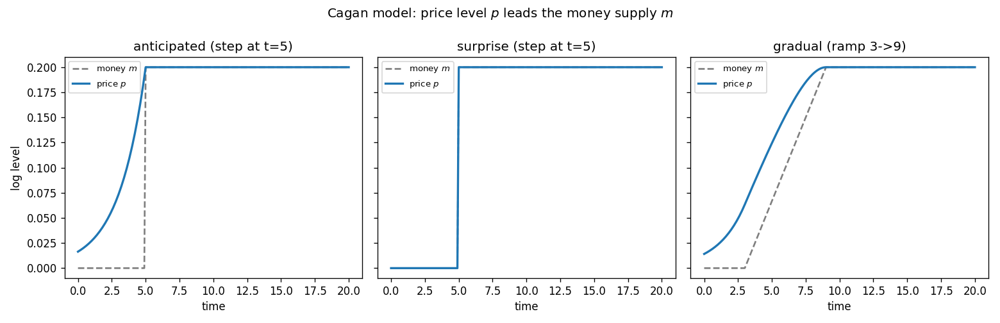

# Cagan model of money and prices

Cagan's (1956) classic model of money and the price level under perfect
foresight. There is a single endogenous variable — the (log) price level `p`,
a **forward-looking jump** — driven by a single exogenous variable, the (log)
money supply `m`. The shared model lives in [`common.mod`](common.mod); each
scenario file `@#include`s it and adds only a `shocks` and a `simulate` block.

This is a **pure forward-looking model with no predetermined state**: there is
no capital, no lagged variable, nothing to carry history. Consequently there is
**no `initval` block** — the price level is pinned entirely by the future, not
by where it starts.

## The model

| | equation | meaning |
|---|---|---|
| jump | `diff(p) = (p - m) / alpha` | Cagan money demand / price dynamics |
| algebraic | `m - p = -alpha * dp/dt` | the same equation, as real money demand |

Real money demand falls with expected inflation, which under perfect foresight
equals actual inflation `dp/dt`:

$$m - p = -\alpha\,\dot p \quad\Longleftrightarrow\quad \dot p = \frac{p - m}{\alpha},$$

where `alpha > 0` (here `alpha = 2`) is the semi-elasticity of money demand to
expected inflation. The coefficient on `p` is **positive**, so `p` is the
*unstable* root: it is pinned not by an initial condition but by the requirement
that it not explode toward `±∞`. The non-explosive solution makes the price
level the discounted present value of all future money,

$$p(t) = \frac{1}{\alpha}\int_t^{\infty} e^{-(s-t)/\alpha}\,m(s)\,ds,$$

so **prices lead anticipated money**: `p` responds to changes in `m` *before*
they happen. The steady state is simply `p = m`.

## Factoring with the macroprocessor

`common.mod` holds the declarations, the `model` block, and the analytical
`steady_state_model`. The scenarios pull it in with one directive:

```
@#include "common.mod"
```

Includes are resolved relative to the including file, so the scenarios run from
any working directory. Block ordering is preserved: the include supplies the
declarations and model up front, and each scenario then appends its `shocks` and
`simulate` blocks.

## The scenarios

All three share the same model and the same `simulate(T=20, N=200)`; they differ
only in how the money supply is disturbed and what agents know when.

| file | money path | information | segments |
|---|---|---|---|
| [`cagan.mod`](cagan.mod) | permanent step `m: 0 → 0.2` **at `t=5`**, via `step` | **anticipated** at `t=0` | one |
| [`cagan_surprise.mod`](cagan_surprise.mod) | permanent step `m: 0 → 0.2` **at `t=5`** | **unanticipated** until `t=5` | two |
| [`cagan_gradual.mod`](cagan_gradual.mod) | linear `m: 0 → 0.2` over `[3, 9]`, via `ramp` | **anticipated** at `t=0` | one |

The instructive pair is `cagan` vs `cagan_surprise`: the eventual money path is
*identical*, but the information differs. Under anticipation the price level
starts rising at `t=0` (agents bring the news forward), reaching the new level
right as money jumps; under the surprise it stays flat until the reveal at
`t=5`, when the horizon is split into two solved segments and `p` jumps straight
to `0.2`.

Shock paths are symbolic functions of the reserved time `t`. Besides the
`if(condition, then, else)` helper and the comparison/logical operators, a small
library of **shape helpers** is available in shocks blocks (only there — they
are rejected in `model` equations):

| helper | shape |
|---|---|
| `step(t, t0)` | 0 before `t0`, 1 from `t0` on |
| `pulse(t, t0, t1)` | 1 on `[t0, t1)`, 0 elsewhere |
| `ramp(t, t0, t1)` | 0, then linear 0→1 over `[t0, t1]`, then 1 |
| `expdecay(t, t0, tau)` | 0 before `t0`, then `exp(-(t-t0)/tau)` (1 at `t0`) |

Scale and shift them like any expression — `0.2 * step(t, 5)`,
`0.2 * ramp(t, 3, 9)`. The `path at t=... = ...` form declares the reveal times
that create segments; a bare `path = ...` is revealed at `t=0` (a single,
anticipated segment).

The three scenarios (generated by `run_cagan.py`), each overlaying the price
level `p` on the money supply `m`:



## Simulation results

The three runs make the central message of the model visible at a glance.

- **Anticipated** (`cagan.mod`): money does not move until `t=5`, but the price
  level **jumps up immediately at `t=0`** (to `p(0) ≈ 0.016`) and rises smoothly
  ahead of the money increase, arriving at `0.2` just as money steps up. Prices
  *lead* money because today's price is the present value of future money, and
  the future money is higher.
- **Surprise** (`cagan_surprise.mod`): with the same eventual money path but no
  advance knowledge, the price level stays **flat at `0` until `t=5`**, then
  jumps discontinuously to `0.2` at the reveal. With nothing to anticipate,
  there is no lead — prices move only when the news arrives.
- **Gradual** (`cagan_gradual.mod`): money ramps up linearly over `[3, 9]`, and
  the price level **leads the ramp** throughout — it starts rising at `t=0`
  (before money begins moving at `t=3`), stays above the money path through the
  transition (`p(t=5) ≈ 0.124`), and converges to `0.2` as money settles.

In every anticipated case the lead reflects the forward-looking nature of the
single jump variable; in the surprise case the absence of a lead reflects that
agents cannot price in what they do not yet know.

## Running

With continuo installed (`pip install -e .` from the repository root):

```console
$ continuo examples/cagan/cagan.mod              # writes cagan.csv next to it
continuo: wrote 201 rows to examples/cagan/cagan.csv
```

Override the horizon `T`, grid resolution `N`, or output path on the command
line:

```console
$ continuo examples/cagan/cagan.mod -T 30 -N 300 -o /tmp/cagan.csv
```

Or run every scenario and overlay them (writes `cagan.png`):

```console
$ python examples/cagan/run_cagan.py
```

```python
import continuo

model = continuo.parse("examples/cagan/cagan.mod")
sol = model.simul()                 # or model.simul(horizon=30, intervals=300)
print(sol["p"][0])                  # price level on impact (leads the money jump)
```

## References

- Cagan, P. (1956). "The Monetary Dynamics of Hyperinflation," in M. Friedman
  (ed.), *Studies in the Quantity Theory of Money*, University of Chicago Press.
- Sargent, T. J. & Wallace, N. (1973). "The Stability of Models of Money and
  Growth with Perfect Foresight," *Econometrica* 41(6): 1043–1048.
