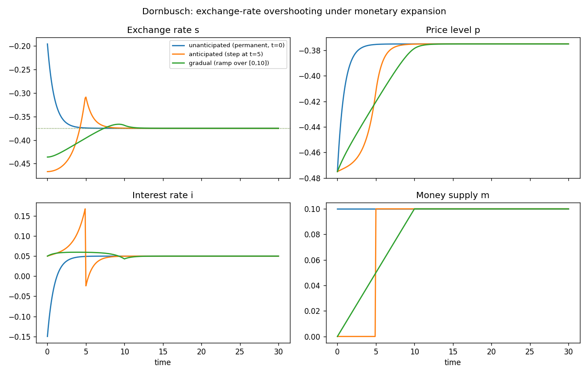

# Continuous-time Dornbusch overshooting

A textbook small open economy à la Dornbusch (1976): a sticky (log) price level
`p`, a freely floating (log) exchange rate `s`, the domestic interest rate `i`
as a static function of the state, and the (log) money supply `m` as the
exogenous driver. The shared model lives in [`common.mod`](common.mod); each
scenario file `@#include`s it and adds only an `initval`, a `shocks`, and a
`simulate` block.

## The model

| | equation | meaning |
|---|---|---|
| algebraic | `i = (phi*ybar - m + p)/lambda` | money market / LM: real balances = money demand |
| state | `diff(p) = psi*gamma*(s - p)` | sticky prices crawl toward demand (competitiveness `s - p`) |
| jump  | `diff(s) = i - istar` | uncovered interest parity under perfect foresight |

Real money demand falls with the interest rate and rises with (constant) output
`ybar`, so the LM relation pins the interest rate from real balances:

$$i = \frac{\phi\,\bar y - m + p}{\lambda}.$$

Under perfect foresight expected depreciation equals actual depreciation, and
uncovered interest parity ties it to the interest differential:

$$\dot s = i - i^\*.$$

Goods prices are **sticky**: they cannot jump and instead crawl toward demand,
which rises with competitiveness `s - p` (a real depreciation shifts demand
onto home goods):

$$\dot p = \psi\,\gamma\,(s - p).$$

The Jacobian of `(p, s)` has eigenvalues of **opposite sign** — a saddle. The
price level `p` is **predetermined** (it cannot jump); the exchange rate `s` is
**free** to jump. The stable manifold then pins a unique perfect-foresight
path. Parameter values: `lambda=0.5`, `gamma=0.4`, `psi=1.0`, `ybar=1`,
`istar=0.05`, `phi=0.5`.

> Both `p` and `s` share the same long-run value: setting `diff(p)=diff(s)=0`
> gives `i = istar` and `s = p = m + lambda*istar - phi*ybar`. At `m = 0` that
> is `-0.475`; at `m = 0.1` it is `-0.375`. A monetary expansion raises both
> one-for-one in the long run (money neutrality), but the *adjustment* is where
> the action is.

## Factoring with the macroprocessor

`common.mod` holds the declarations, the `model` block, and the analytical
`steady_state_model` (which must define **every** endogenous variable — the two
dynamic variables `p`, `s` and the algebraic `i`). The scenarios pull it in
with one directive:

```
@#include "common.mod"
```

Includes are resolved relative to the including file, so the scenarios run from
any working directory. Block ordering is preserved: the include supplies the
declarations and model up front, and each scenario then appends its `initval`,
`shocks`, and `simulate` blocks.

## The scenarios

All three share the same model and the same `simulate(T=30, N=300)`; they differ
only in how money is increased and what agents know when.

| file | disturbance | information | initial state |
|---|---|---|---|
| [`dornbusch.mod`](dornbusch.mod) | **permanent** step `m: 0→0.1` from `t=0` | **unanticipated**, live at `t=0` | anchored at the pre-shock (`m=0`) SS |
| [`dornbusch_anticipated.mod`](dornbusch_anticipated.mod) | permanent step `m: 0→0.1` **at `t=5`**, via `step` | **anticipated** at `t=0` (one segment) | `m=0` SS |
| [`dornbusch_gradual.mod`](dornbusch_gradual.mod) | **gradual** ramp `m: 0→0.1` over `[0,10]`, via `ramp` | known at `t=0` (one segment) | `m=0` SS |

Shock paths are symbolic functions of the reserved time `t`. Besides the
`if(condition, then, else)` helper and the comparison/logical operators, a small
library of **shape helpers** is available in `shocks` blocks (only there — they
are rejected in `model` equations):

| helper | shape |
|---|---|
| `step(t, t0)` | 0 before `t0`, 1 from `t0` on |
| `pulse(t, t0, t1)` | 1 on `[t0, t1)`, 0 elsewhere |
| `ramp(t, t0, t1)` | 0, then linear 0→1 over `[t0, t1]`, then 1 |
| `bump(t, t0, t1)` | smooth bump on `(t0, t1)`, peak 1 at the centre |
| `expdecay(t, t0, tau)` | 0 before `t0`, then `exp(-(t-t0)/tau)` (1 at `t0`) |
| `smoothstep(t, t0, k)` | logistic step at `t0`, steepness `k` (0.5 at `t0`) |

Scale and shift them like any expression — here `0.1 * step(t, 5)` and
`0.1 * ramp(t, 0, 10)`. A bare `path = 0.1` is anticipated from `t=0`.

The three scenarios overlaid (generated by `run_dornbusch.py`):



## Simulation results

The defining result is **overshooting**, visible in the unanticipated run.
Money jumps to `0.1` at `t=0`. Prices are sticky, so on impact real balances
`m - p` rise; the LM relation then requires the interest rate to *fall* (here to
`i(0) = -0.15`, well below `istar`). But under UIP a low domestic interest rate
means the exchange rate must be *appreciating* along the path (`diff(s) = i -
istar < 0`). For `s` to be falling while ending up at a *higher* (more
depreciated) long-run level, it must jump on impact **past** that long-run
level. So the exchange rate overshoots:

| scenario | `s(0)` | `s(end)` | overshoot `s(0)−s(end)` |
|---|---:|---:|---:|
| unanticipated | `-0.196` | `-0.375` | **`+0.179`** |
| anticipated (`t=5`) | `-0.467` | `-0.375` | `-0.092` |
| gradual (`[0,10]`) | `-0.436` | `-0.375` | `-0.061` |

In the unanticipated case `s` jumps from `-0.475` up to `-0.196` — far above its
new long-run value `s* = -0.375` (the dotted line on the `s` panel) — then
**appreciates** back down to `-0.375` as the sticky price `p` slowly rises from
`-0.475` to `-0.375`. The interest rate climbs from `-0.15` back to `istar`.
All three runs end at `s(end) ≈ p(end) ≈ -0.375`, confirming the saddle path
lands on the new (`m=0.1`) steady state.

Anticipation and gradualism **dampen the overshoot**. When the same money
increase is announced for `t=5`, the exchange rate jumps at `t=0` (agents bring
the news forward) and prices start moving before money does; the overshoot
relative to the long run is much smaller and is spread over the lead time. When
money instead grows slowly over `[0,10]`, prices keep pace and `s` barely
deviates from a smooth monotone climb — essentially no overshooting, since the
slow, pre-announced increase gives sticky prices time to adjust.

## Running

With continuo installed (`pip install -e .` from the repository root):

```console
$ continuo examples/dornbusch/dornbusch.mod        # writes dornbusch.csv next to it
continuo: wrote 301 rows to examples/dornbusch/dornbusch.csv
```

Override the horizon `T`, grid resolution `N`, or output path on the command
line:

```console
$ continuo examples/dornbusch/dornbusch.mod -T 40 -N 400 -o /tmp/dornbusch.csv
```

Or run every scenario and overlay them (writes `dornbusch.png`):

```console
$ python examples/dornbusch/run_dornbusch.py
```

```python
import continuo

model = continuo.parse("examples/dornbusch/dornbusch.mod")
sol = model.simul()                  # or model.simul(horizon=40, intervals=400)
print(sol["s"][0])                   # exchange rate on impact (the overshoot)
ss = model.steady_state(exogenous={"m": 0.1})   # new long-run s* = p* = -0.375
```

## A note on anchoring `dornbusch`

When a permanent change is already live at `t=0`, the predetermined state must
be anchored at the *pre-shock* steady state rather than the active one.
`dornbusch.mod` does this with the `initval(steady, e={…})` override:

```
initval(steady, e={m: 0});   // fill the price level from the steady state at m = 0
end;
```

`initval(steady)` fills every state from the initial steady state; the `e={…}`
argument evaluates that steady state at the given exogenous values (here `m=0`)
instead of the active ones (`m=0.1`). The anticipated and gradual scenarios
have `m=0` at `t=0`, so a plain `initval(steady)` already anchors them at the
`m=0` steady state.

## References

- Dornbusch, R. (1976), "Expectations and Exchange Rate Dynamics," *Journal of
  Political Economy* 84(6):1161–1176.
- Obstfeld, M. & Rogoff, K. (1996), *Foundations of International
  Macroeconomics*, MIT Press.
