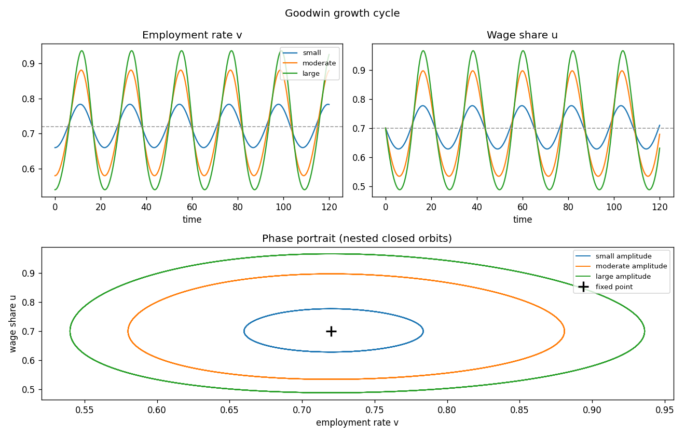

# Goodwin growth cycle

Goodwin's (1967) growth cycle — a Lotka–Volterra ("predator–prey") model of
distributive conflict. Two **state** variables, the employment rate `v` and the
wage share `u`, chase each other around a closed orbit: booms raise employment,
which raises the wage share, which squeezes profits and investment, which cools
employment, which lets the wage share fall and restores profits. The shared
model lives in [`common.mod`](common.mod); each scenario `@#include`s it and
adds only an `initval` and a `simulate` block.

Unlike the other examples in this gallery, this one is **not** an optimising,
forward-looking model — and that changes its boundary structure (see
[Why there is no terminal condition](#why-there-is-no-terminal-condition)).

## The model

| | equation | meaning |
|---|---|---|
| state | `diff(v) = v*((1 - u)/sigma - (alpha + beta))` | employment grows when profit-financed accumulation outruns productivity + labour-force growth |
| state | `diff(u) = u*(rho*v - (gamma + alpha))` | the wage share grows when employment is high enough that real wages outpace productivity |

Behind the two laws of motion: output is Leontief in capital (capital–output
ratio `sigma`), labour productivity grows at `alpha` and the labour force at
`beta`, a real-wage Phillips curve `dw/w = -gamma + rho*v` makes wage growth
increasing in employment, and all profits are invested. Eliminating the levels
leaves the predator–prey system above. Parameter values: `sigma=3`,
`alpha=0.06`, `beta=0.04`, `gamma=0.3`, `rho=0.5`.

Setting both time derivatives to zero gives a single interior fixed point,

$$v^\* = \frac{\gamma+\alpha}{\rho} = 0.72, \qquad u^\* = 1 - \sigma(\alpha+\beta) = 0.70.$$

It is a **centre**: the linearisation has purely imaginary eigenvalues, and the
full nonlinear system has a conserved quantity, so trajectories are **closed
orbits** around the fixed point. The economy neither converges to it nor
diverges — it cycles forever, with an amplitude fixed entirely by the initial
condition.

## Why there is no terminal condition

continuo solves a two-point boundary-value problem: **states** are pinned at
`t=0` (from `initval`) and **jumps** are pinned at the terminal steady state
(`t₀+T`), the latter selecting the saddle-stable manifold of a forward-looking
model. The Goodwin model has **no jump variables** — `v` and `u` are both
physical, predetermined states — so the terminal half of the boundary
conditions is empty. The problem reduces to a pure **initial-value problem**:
the two initial conditions plus the collocation equations are exactly square,
and the solution is determined by `(v(0), u(0))` alone. Nothing is fixed at
`T`.

This is the structural opposite of the saddle-path examples (RBC, Dornbusch,
Tobin's q, NK): there, a jump's terminal anchor picks the unique non-explosive
path; here, the fixed point is a centre, there is no stable manifold to select,
and history alone pins the trajectory. The `steady_state_model` block is still
provided, but only to **seed the solver's initial guess** — it is not imposed
as a boundary condition, and the path deliberately does not approach it.

## Factoring with the macroprocessor

`common.mod` holds the declarations, the `model` block, and the (guess-only)
`steady_state_model`. The scenarios pull it in with one directive:

```
@#include "common.mod"
```

Because the model is autonomous (no `varexo`, no `shocks`), the scenarios differ
*only* in the initial condition — the amplitude of the cycle.

## The scenarios

All three share the same model and `simulate(T=120, N=2400)`; each starts at the
bottom of its employment swing (`u(0)=u*=0.70`, a turning point of `v`) and
differs only in how far below `v*=0.72` it begins.

| file | `v(0)` | orbit |
|---|---|---|
| [`goodwin_small.mod`](goodwin_small.mod) | 0.66 | small, near-elliptical (the linearised limit) |
| [`goodwin.mod`](goodwin.mod) | 0.58 | moderate amplitude |
| [`goodwin_large.mod`](goodwin_large.mod) | 0.54 | large, markedly non-elliptical |

The three orbits overlaid (generated by `run_goodwin.py`):



## Simulation results

The time series show employment `v` and the wage share `u` oscillating with a
common period (≈ 22 time units here) and a quarter-cycle **phase lag**: the wage
share peaks *after* employment, as the predator lags the prey. The phase
portrait is the signature picture — three **nested closed orbits** around the
fixed point `+`, each set by its initial amplitude:

| scenario | `v` range | `u` range |
|---|---|---|
| small | [0.66, 0.78] | [0.63, 0.78] |
| moderate | [0.58, 0.88] | [0.53, 0.90] |
| large | [0.54, 0.94] | [0.49, 0.97] |

Larger orbits are visibly non-elliptical — long, shallow depressions punctuated
by sharp booms — while the period barely changes, the hallmark of a
Lotka–Volterra centre. That the orbits *close* (rather than spiral in or out)
over five-plus periods is a check on the solver: continuo's Crank–Nicolson
(implicit-midpoint) scheme nearly conserves the model's invariant. Over much
longer horizons a small drift can accumulate; raise `N` or shorten `T` if you
need many periods at high fidelity.

## Running

With continuo installed (`pip install -e .` from the repository root):

```console
$ continuo examples/goodwin/goodwin.mod        # writes goodwin.csv next to it
continuo: wrote 2401 rows to examples/goodwin/goodwin.csv
```

Or run every scenario and draw the phase portrait (writes `goodwin.png`):

```console
$ python examples/goodwin/run_goodwin.py
```

```python
import continuo

model = continuo.parse("examples/goodwin/goodwin.mod")
sol = model.simul()
print(sol["v"].min(), sol["v"].max())   # employment swings over the cycle
fp = model.steady_state()               # the centre of the orbit (a guess seed)
```

## Discretisation accuracy

Because the orbit is smooth and closed, it is a clean test of the
discretisation schemes (see the [manual](../../doc/manual/schemes.rst)). The
companion runner solves the moderate scenario at a range of grid resolutions
`N` with Crank–Nicolson (order 2), Gauss–Legendre order 4 and Radau IIA order
5, measured against a fine Gauss order-6 reference, and writes a log–log error
plot (`schemes.png`):

```console
$ python examples/goodwin/run_schemes.py
```

The error falls like `h^p` with the scheme order `p`, so the higher-order
schemes reach at `N = 150` an accuracy Crank–Nicolson does not match even at
`N = 1200`:

| N    | crank_nicolson (2) | gauss (4) | radau (5) |
|------|--------------------|-----------|-----------|
| 150  | 2.7e-02            | 2.3e-05   | 5.3e-07   |
| 300  | 6.9e-03            | 1.4e-06   | 1.6e-08   |
| 600  | 1.7e-03            | 9.0e-08   | 5.2e-10   |
| 1200 | 4.3e-04            | 5.6e-09   | 1.6e-11   |

```python
sol = model.simul(scheme="radau", order=5)   # or scheme="gauss", scheme="lobatto_iiia"
```

## References

- Goodwin, R.M. (1967), "A Growth Cycle," in C.H. Feinstein (ed.), *Socialism,
  Capitalism and Economic Growth*, Cambridge University Press, pp. 54–58.
- Lotka, A.J. (1925), *Elements of Physical Biology*; Volterra, V. (1926),
  "Fluctuations in the abundance of a species considered mathematically,"
  *Nature* 118:558–560 (the underlying predator–prey dynamics).
- Gandolfo, G. (2009), *Economic Dynamics*, 4th ed., Springer (textbook
  treatment of the Goodwin model).
