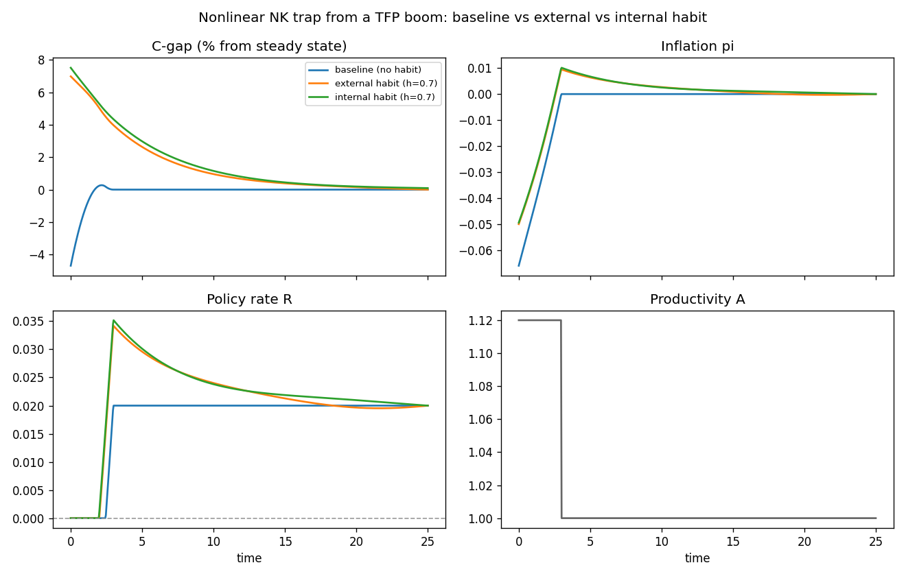

# Continuous-time New Keynesian models (nonlinear)

This folder builds the **fully nonlinear** continuous-time New Keynesian model
in three flavours, all driven by the same exogenous **TFP shock**: a
temporary productivity boom that lowers marginal cost, drives deflation,
and forces the Taylor rule onto the zero lower bound.

- [`baseline.mod`](baseline.mod) — no habits (the textbook nonlinear NK).
- [`external_habit.mod`](external_habit.mod) — additive habits taken as given
  by the household (catching-up-with-the-Joneses).
- [`internal_habit.mod`](internal_habit.mod) — the same habits **internalised**
  by the household: today's consumption is recognised as raising tomorrow's
  habit stock, so a habit costate enters the optimisation.

The companion folder `examples/nk/` carries the log-linearised version of the
same trap; here the equations are kept in levels, with the policy rate
`R = max(0, ρ + φπ · π)` introducing the ZLB kink directly.

Unlike the other example folders, the three model files here do **not** share
a `common.mod`: the variable sets and the equation systems differ
structurally (internal habit adds a costate; external doesn't), so a literal
`@#include` would not save much and would obscure the comparison. Each `.mod`
is self-contained and readable on its own.

## Algebra → companion slides

The full derivations — household problem, firm problem (Rotemberg), the
two habit variants and their costate equations, every system of equations,
every steady state — live in a Beamer companion document:

**📄 <https://continuo.adjemian.eu/pdf/nk-nonlinear.pdf>** (source:
[`derivations.tex`](derivations.tex))

The PDF is compiled and deployed by CI on every push to `master`, so the
hosted file always tracks the source. Rebuild a local copy with

```console
$ cd examples/nk-nonlinear
$ rubber --shell-escape --pdf --clean derivations.tex
```

The rest of this README sticks to high-level prose and numerical results so
it renders cleanly anywhere; the slides are the source of truth for the
mathematics.

## Variables and roles

The three variants differ in their state/jump/algebraic structure, which is
the main design constraint when transcribing them to `.mod` files:

All three carry the Rotemberg adjustment cost as a real resource loss
through the constraint `Y = C / (1 − (φ/2)π²)`, so output `Y` is a third
algebraic variable in every model.

- **`baseline.mod`** — two jumps (consumption `C`, inflation `π`), three
  algebraic (output `Y`, policy rate `R`, marginal cost
  `MC = Y^η · C^σ / A^(η+1)`), no state, single exogenous (`A`).
- **`external_habit.mod`** — adds a state, the habit stock `X`, with the
  modified Euler `dC/dt = ((C−hX)/σ)(R−π−ρ) + hλ(C−X)` and habit-adjusted
  marginal cost `MC = Y^η · (C−hX)^σ / A^(η+1)`. Two jumps, three algebraic,
  one state.
- **`internal_habit.mod`** — same state `X`, but the household carries a
  costate `μ` on the habit and the wealth costate `λ_B` becomes a jump in
  its own right. Consumption `C` is no longer chosen: it is pinned by the
  consumption FOC `C = hX + (λ_B − λμ)^(−1/σ)` at every grid point. Three
  jumps (`π`, `λ_B`, `μ`), four algebraic
  (`C`, `Y`, `R`, `MC = Y^η/(λ_B·A^(η+1))`), one state.

## Calibration (all three models)

| symbol | value | meaning |
|---|---|---|
| σ      | 1    | inverse IES (log utility) |
| η      | 1    | inverse Frisch elasticity |
| ε      | 6    | elasticity of substitution between varieties (20% markup) |
| φ      | 40   | Rotemberg price-adjustment cost |
| ρ      | 0.02 | rate of time preference (= steady-state real rate) |
| φ_π    | 1.5  | Taylor-rule inflation response |
| λ      | 0.5  | habit adjustment speed (habit variants only) |
| h      | 0.7  | habit weight (habit variants only) |

## The experiment

All three scenarios share the same TFP shock,

```
shocks;
  var A;
  path = 1 + 0.12 * pulse(t, 0, 3);   // A rises to 1.12 on [0, 3), then back to 1
end;
```

revealed at `t = 0` (single belief, one segment). The 12% productivity boom
lowers marginal cost `MC ∝ 1/A^(η+1)`, drives deflation through the NKPC,
and forces the Taylor rule onto the ZLB. All three start at their respective
steady states (`initval(steady)` — vacuous for the baseline since it has no
state). Each is solved on a uniform Crank–Nicolson grid with
`simulate(T = 25, N = 600)`.

### Why a TFP shock (rather than a natural-rate shock)?

The earlier draft of this folder used a "natural-rate" exogenous shock to
the household's discount rate. That device is conventional in NK
liquidity-trap papers but introduces a subtle inconsistency: interpreted as
a preference shifter `ψ(t)·u(C)`, the natural-rate shock would also
propagate through the firm's stochastic discount factor and modify the
NKPC, but standard practice (and earlier versions of this folder) keeps
`ρ` in the NKPC anyway. We replaced it with a TFP shock: `A(t)` enters
only the production technology, not preferences, so the SDF (and the
NKPC) is unaffected. The exact NKPC derived in `derivations.pdf` keeps
`ρ` cleanly because there is no preference shifter to propagate.

## Simulation results

The three scenarios overlaid (generated by `run_nk_nonlinear.py`):



Numerical headlines:

| scenario | C on impact (vs SS) | π trough | R minimum | time spent at ZLB |
|---|---:|---:|---:|---:|
| baseline (no habit)        | **−4.7 %** | −6.60 % | 0 | 9.8 % of horizon |
| external habit (h = 0.7)   |  +7.0 %    | −5.00 % | 0 | 8.0 % of horizon |
| internal habit (h = 0.7)   | **+7.5 %** | −4.95 % | 0 | 8.0 % of horizon |

**The trap mechanism binds in all three cases** — the ZLB binds for 8–10%
of the horizon, deflation reaches −5% to −6.6%. But the consumption
response is dramatically different depending on preferences:

**Baseline (no habit)**: the deflationary trap dominates. With `R = 0` and
`π < 0` during the boom, the real rate exceeds `ρ`, the Euler `Ċ/C =
(R − π − ρ)` says consumption is growing positively, so anchored at `C* =
0.913` at the terminal SS, consumption *starts* below `C*` (a 4.7% drop on
impact). This is the textbook "supply-side deflationary trap": a
productivity boom that the central bank cannot accommodate ends up as a
recession.

**Habit variants**: the wealth effect from a permanent-feeling productivity
gain dominates the real-rate channel. Consumption jumps **up** by 7.0–7.5%
on impact and decays back smoothly. Habit makes the household value
smoothing across both time *and* habit stock, so a positive income surprise
is partially consumed immediately even with a high real rate. The trap
still produces deflation and binds the ZLB, but `C` doesn't fall.

**Pedagogical point**: "trap mechanism" and "recession" are not synonymous.
A TFP boom hits the ZLB and creates deflation in *all* three models, but
whether consumption falls depends on whether the wealth effect or the
real-rate effect dominates — and that's a preference-structure question,
not a monetary-policy question.

## Running

With continuo installed (`pip install -e .` from the repository root):

```console
$ continuo examples/nk-nonlinear/baseline.mod
continuo: wrote 601 rows to examples/nk-nonlinear/baseline.csv

$ python examples/nk-nonlinear/run_nk_nonlinear.py     # overlays all three, writes nk-nonlinear.png
```

The CSV columns are `t, C, pi, R, MC, Y` for the baseline; the habit
variants add `X` and (for internal habit) `mu, lambda_B`.

```python
import continuo

model = continuo.parse("examples/nk-nonlinear/internal_habit.mod")
sol = model.simul()
ss  = model.steady_state(exogenous={"A": 1.0})
print(sol["C"][0] / ss["C"] - 1)   # consumption gap on impact
```

## References

The full bibliography is on the last slide of `derivations.pdf`. Headline
references: Werning (2011, NBER WP 17344) for the continuous-time NK and
liquidity-trap setup; Rotemberg (1982, *JPE*) for the quadratic
price-adjustment foundation; Cochrane (2017, *JME*) and Galí (2015,
*Monetary Policy, Inflation, and the Business Cycle*) for the broader NK
literature; Abel (1990, *AER P&P*) for external habit; Constantinides (1990,
*JPE*) for internal habit; Christiano–Eichenbaum–Evans (2005, *JPE*) for
habits as a source of output persistence in medium-scale DSGE models.
