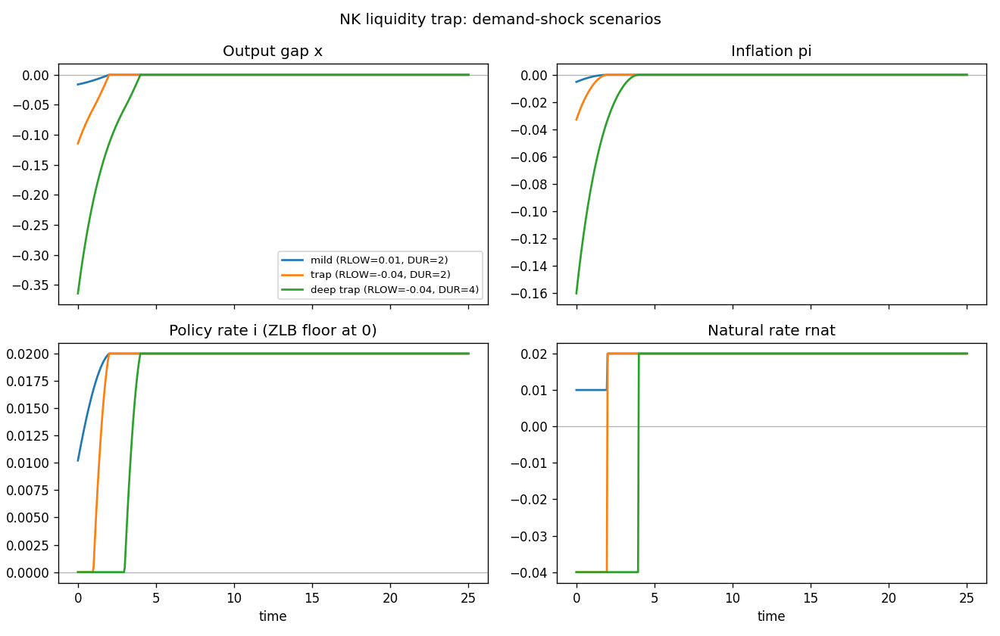

# Continuous-time New Keynesian model with a zero lower bound

A textbook continuous-time New Keynesian economy in the Werning (2011) form,
with two **forward-looking** variables — the output gap `x` and inflation `pi`
— and the nominal policy rate `i` as a static Taylor rule clamped at zero, the
**zero lower bound** (ZLB). The natural rate of interest `rnat` is exogenous; a
temporary fall in it is a *demand shock* that can push the economy into a
liquidity trap. The shared model lives in [`common.mod`](common.mod); each
scenario file `@#include`s it and adds only a `shocks` and a `simulate` block.

## The model

| | equation | meaning |
|---|---|---|
| jump | `diff(x) = sigma*(i - pi - rnat)` | dynamic IS (Euler) equation |
| jump | `diff(pi) = rho*pi - kappa*x` | New Keynesian Phillips curve |
| algebraic | `i = max(0, rho + phipi*pi + phix*x)` | Taylor rule with the ZLB |

The output gap rises when the real rate `i - pi` exceeds the natural rate
`rnat`, and inflation is driven forward-looking by the gap through the Phillips
curve. The central bank follows a Taylor rule but cannot set a negative nominal
rate: the `max(0, .)` clamps the policy rate at the floor.

This is a **pure forward-looking system** — both endogenous dynamic variables
(`x` and `pi`) are jumps, and there is *no* predetermined state to anchor. The
model therefore needs **no `initval` block**: it is pinned down entirely by the
terminal steady state and the exogenous path of `rnat`. The baseline `rnat`
returns to `rho = 0.02` after the shock, so the terminal steady state is the
normal one (`x = 0`, `pi = 0`, `i = 0.02`).

The ZLB is an **occasionally-binding constraint**, expressed directly with
`max`. Its kink is handled by the solver on the time grid; at `N = 500` the
plain `max(0, .)` converges without any smoothing.

## Factoring with the macroprocessor

`common.mod` holds the declarations, the `model` block, and the analytical
`steady_state_model`. The scenarios pull it in with one directive:

```
@#include "common.mod"
```

Includes are resolved relative to the including file, so the scenarios run from
any working directory. Block ordering is preserved: the include supplies the
declarations and model up front, and each scenario then appends its `shocks`
and `simulate` blocks. Every endogenous variable (the jumps `x`, `pi` and the
algebraic `i`) is defined in `steady_state_model`, as continuo requires.

## The scenarios

All three share the same model and the same `simulate(T=25, N=500)`, and all are
**single-belief** runs (the trap duration is known at `t = 0`, one segment).
They differ only in the size and length of the temporary drop in `rnat`, written
with the `pulse` helper as `path = 0.02 + (RLOW - 0.02) * pulse(t, 0, DUR)`.

| file | RLOW | DUR | what happens |
|---|---|---|---|
| [`nk_mild.mod`](nk_mild.mod) | `0.01` | `2` | small shock; ZLB **slack** (`i_min > 0`), mild linear recession |
| [`nk_trap.mod`](nk_trap.mod) | `-0.04` | `2` | liquidity trap; ZLB **binds** (`i = 0`), recession and deflation |
| [`nk_deep_trap.mod`](nk_deep_trap.mod) | `-0.04` | `4` | longer *expected* trap; far deeper recession **today** |

The three scenarios overlaid (generated by `run_nk.py`):



## Simulation results

The summary numbers (`x_min`, `pi_min`, `i_min`) printed by `run_nk.py`:

| scenario | `x_min` | `pi_min` | `i_min` |
|---|---|---|---|
| `nk_mild` | `-0.016` | `-0.005` | `0.010` |
| `nk_trap` | `-0.114` | `-0.033` | `0.000` |
| `nk_deep_trap` | `-0.364` | `-0.160` | `0.000` |

* In **`nk_mild`** the demand shock is small. The Taylor rule cuts the policy
  rate but keeps it strictly positive (`i_min ≈ 0.010 > 0`): the `max(0, .)` is
  slack, so the model behaves like its linear counterpart and the recession is
  mild. The economy reacts only to the active drop and returns smoothly to
  steady state once `rnat` recovers.

* In **`nk_trap`** the natural rate goes deeply negative. The Taylor rule wants a
  negative nominal rate, but the ZLB binds: `i` is pinned at zero (`i_min = 0`).
  With monetary policy stuck at the floor the real rate stays too high, so the
  economy cannot offset the shock — output falls (`x_min ≈ -0.11`) and inflation
  turns negative (`pi_min ≈ -0.03`), a recession *with deflation*.

* In **`nk_deep_trap`** the shock is identical to `nk_trap` but the trap is
  *expected* to last twice as long (`DUR = 4`). Because `x` and `pi` are
  forward-looking, the longer expected ZLB episode feeds back into today's
  decisions: the recession is far deeper on impact (`x_min ≈ -0.36`). This is the
  hallmark forward-looking result of the liquidity-trap literature — a longer
  *expected* trap causes a deeper recession **today**.

## Running

With continuo installed (`pip install -e .` from the repository root):

```console
$ continuo examples/nk/nk_trap.mod        # writes nk_trap.csv next to it
continuo: wrote 501 rows to examples/nk/nk_trap.csv
```

Override the horizon `T`, grid resolution `N`, or output path on the command
line:

```console
$ continuo examples/nk/nk_deep_trap.mod -T 40 -N 800 -o /tmp/nk.csv
```

Or run every scenario and overlay them (writes `nk.png`):

```console
$ python examples/nk/run_nk.py
```

```python
import continuo

model = continuo.parse("examples/nk/nk_trap.mod")
sol = model.simul()                 # or model.simul(horizon=40, intervals=800)
print(sol["x"].min(), sol["i"].min())   # trough of the gap; ZLB floor
```

## References

* Werning, I. (2011), "Managing a Liquidity Trap: Monetary and Fiscal Policy,"
  NBER Working Paper 17344.
* Eggertsson, G. & Woodford, M. (2003), "The Zero Bound on Interest Rates and
  Optimal Monetary Policy," *Brookings Papers on Economic Activity* 2003(1):
  139–211.
* Cochrane, J. (2017), "The New-Keynesian Liquidity Trap," *Journal of Monetary
  Economics* 92: 47–63.
* Galí, J. (2015), *Monetary Policy, Inflation, and the Business Cycle*,
  2nd ed., Princeton University Press.
