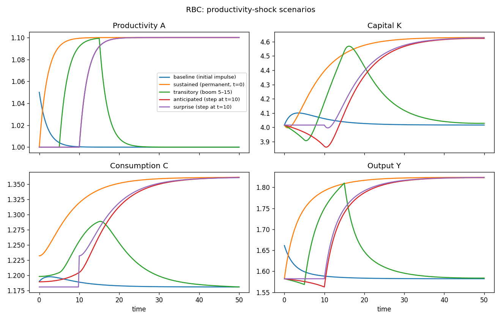

# Continuous-time RBC

A textbook Ramsey/RBC economy with two state variables — capital `K` and total
factor productivity `A` — one jump variable (consumption `C`), and output `Y`
as a static function of the states. The shared model lives in
[`common.mod`](common.mod); each scenario file `@#include`s it and adds only an
`initval`, a `shocks`, and a `simulate` block.

## The model

| | equation | meaning |
|---|---|---|
| state | `diff(K) = Y - C - delta*K` | capital accumulation |
| state | `diff(A) = theta*(1 - A) + e` | productivity (stable AR(1)) |
| jump  | `diff(C) = C*(alpha*Y/K - delta - rho)` | consumption Euler (log utility) |
| algebraic | `Y = A*K^alpha` | Cobb–Douglas production |

Productivity is a **stable continuous-time AR(1)** — an Ornstein–Uhlenbeck
process in levels. It mean-reverts to its long-run level `1` at speed `theta`,
forced by the innovation `e`:

$$\dot A = \theta\,(1 - A) + e.$$

With `e = 0` the solution is $A(t) = 1 + (A_0 - 1)\,e^{-\theta t}$: a deviation
from the mean decays exponentially, the continuous-time counterpart of a
discrete AR(1) with autoregressive root $e^{-\theta}$ and half-life
$\ln 2 / \theta$. For `theta = 0.5` that is about 1.4 time units.

> The level form `theta*(1 - A) + e` keeps the steady state finite and the
> dynamics stable for any `theta > 0`. (A multiplicative law such as
> `diff(A) = A^rho*exp(e)` has *no* finite steady state — `diff(A) > 0`
> everywhere — so productivity would grow without bound.)

## Factoring with the macroprocessor

`common.mod` holds the declarations, the `model` block, and the analytical
`steady_state_model`. The scenarios pull it in with one directive:

```
@#include "common.mod"
```

Includes are resolved relative to the including file, so the scenarios run from
any working directory. Block ordering is preserved: the include supplies the
declarations and model up front, and each scenario then appends its `initval`,
`shocks`, and `simulate` blocks.

## The scenarios

All five share the same model and the same `simulate(T=50, N=250)`; they differ
only in how productivity is disturbed and where the economy starts.

| file | disturbance | information | initial state |
|---|---|---|---|
| [`rbc.mod`](rbc.mod) | transitory, via the **initial condition** (`A(0)=1.05`) | — | capital at the `e=0` SS |
| [`rbc_sustained.mod`](rbc_sustained.mod) | **permanent** step `e=0.05` from `t=0` | known at `t=0` | anchored at the pre-shock (`e=0`) SS |
| [`rbc_transitory.mod`](rbc_transitory.mod) | **transitory** boom `e=0.05` over `[5,15)`, via `pulse` | known at `t=0` (one segment) | `e=0` SS |
| [`rbc_anticipated.mod`](rbc_anticipated.mod) | permanent step `e=0.05` **at `t=10`**, via `step` | **anticipated** at `t=0` (one segment) | `e=0` SS |
| [`rbc_surprise.mod`](rbc_surprise.mod) | permanent step `e=0.05` **at `t=10`** | **unanticipated** until `t=10` (two segments) | `e=0` SS |

The instructive pair is `rbc_anticipated` vs `rbc_surprise`: the eventual
productivity path is *identical*, but the information differs. Under
anticipation consumption jumps at `t=0` (agents bring the news forward); under
the surprise it stays on the old steady state until the reveal at `t=10`, when
the horizon is split into two solved segments.

Shock paths are symbolic functions of the reserved time `t`. Besides the
`if(condition, then, else)` helper and the comparison/logical operators (`>=`,
`&&`, …), a small library of **shape helpers** is available in shocks blocks
(only there — they are rejected in `model` equations):

| helper | shape |
|---|---|
| `step(t, t0)` | 0 before `t0`, 1 from `t0` on |
| `pulse(t, t0, t1)` | 1 on `[t0, t1)`, 0 elsewhere |
| `ramp(t, t0, t1)` | 0, then linear 0→1 over `[t0, t1]`, then 1 |
| `bump(t, t0, t1)` | smooth bump on `(t0, t1)`, peak 1 at the centre |
| `expdecay(t, t0, tau)` | 0 before `t0`, then `exp(-(t-t0)/tau)` (1 at `t0`) |
| `smoothstep(t, t0, k)` | logistic step at `t0`, steepness `k` (0.5 at `t0`) |

Scale and shift them like any expression — `1.0 + 0.05 * pulse(t, 8, 12)`,
`0.05 * expdecay(t, 5, 3)`. The `path at t=... = ...` form declares the reveal
times that create segments.

The five scenarios overlaid (generated by `run_rbc.py`):



Productivity `A` is a predetermined state, so the anticipated and surprise runs
share an identical `A` path; the information difference shows up in consumption
— `C` jumps at `t=0` under anticipation but stays flat until the `t=10` reveal
under the surprise.

## Running

With continuo installed (`pip install -e .` from the repository root):

```console
$ continuo examples/rbc/rbc_surprise.mod        # writes rbc_surprise.csv next to it
continuo: wrote 251 rows to examples/rbc/rbc_surprise.csv
```

Override the horizon `T`, grid resolution `N`, or output path on the command
line:

```console
$ continuo examples/rbc/rbc.mod -T 80 -N 400 -o /tmp/rbc.csv
```

Or run every scenario and overlay them (writes `rbc.png`):

```console
$ python examples/rbc/run_rbc.py
```

```python
import continuo

model = continuo.parse("examples/rbc/rbc_anticipated.mod")
sol = model.simul()                 # or model.simul(horizon=80, intervals=400)
print(sol["C"][0])                  # consumption on impact
ss = model.steady_state(exogenous={"e": 0.05})
```

## A note on anchoring `rbc_sustained`

When a permanent change is already live at `t=0`, the predetermined states must
be anchored at the *pre-shock* steady state rather than the active one.
`rbc_sustained.mod` does this with the `initval(steady, e={…})` override:

```
initval(steady, e={e: 0});   // fill states from the steady state at e = 0
end;
```

`initval(steady)` fills every state from the initial steady state; the `e={…}`
argument evaluates that steady state at the given exogenous values (here `e=0`)
instead of the active ones (`e=0.05`). The same override is available on the
per-variable callable, `steady_state(K, e={e: 0})`, for use inside a plain
`initval` block.

## Adaptive grids

The baseline response adjusts fast early (the saddle path) and slowly in the
long mean-reverting tail — so a uniform grid over-resolves the tail and
under-resolves the start (the `equidistribution_ratio` diagnostic is ~24).
Turning on adaptive refinement (see the [manual](../../doc/manual/grids.rst))
concentrates nodes where the path bends and balances the error (ratio ~1.5):

```console
$ python examples/rbc/run_adapt.py
```

```python
sol = model.simul(adapt=1e-6)            # refine until the error estimate < 1e-6
# or in the .mod file:  simulate(T=50, N=250, adapt=1e-6);
```

The runner writes `adapt.png`: the capital path with the adaptive nodes, and
the step size against time (fine near `t=0`, coarse in the tail).
