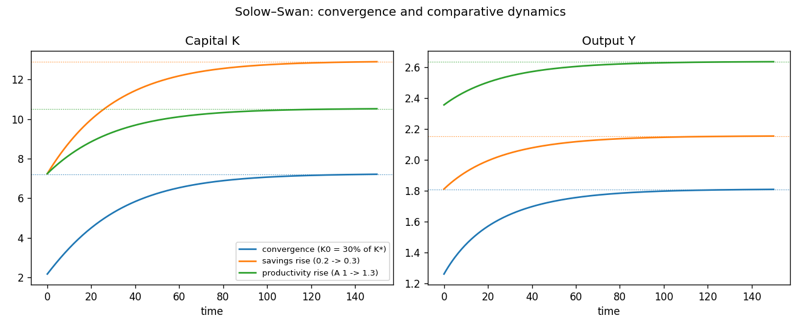

# Continuous-time Solow–Swan growth

The textbook Solow–Swan growth model with a single state variable — the capital
stock `K` — and output `Y` as a static function of it. There is **no jump
variable**: capital is purely predetermined and its law of motion is a single
ordinary differential equation, so this is a clean *initial-value problem* (no
saddle path, no forward-looking root) — which the same continuo machinery
solves just as happily as the saddle-path RBC. The shared model lives in
[`common.mod`](common.mod); each scenario file `@#include`s it and adds only an
`initval`, a `shocks`, and a `simulate` block.

## The model

| | equation | meaning |
|---|---|---|
| algebraic | `Y = A*K^alpha` | Cobb–Douglas production |
| state | `diff(K) = sav*Y - delta*K` | capital accumulation |

Gross saving `sav*Y` adds to the capital stock; depreciation `delta*K` subtracts
from it. With diminishing returns (`alpha < 1`) the marginal product of capital
is high when `K` is scarce and falls as `K` grows, so capital converges
**monotonically** to a unique positive steady state from any positive start:

$$K^\* = \left(\frac{\mathrm{sav}\,A}{\delta}\right)^{1/(1-\alpha)},\qquad
Y^\* = A\,(K^\*)^{\alpha}.$$

The savings rate `sav` and total factor productivity `A` are declared `varexo`
so they can be shocked; `alpha = 0.3` and `delta = 0.05` are fixed parameters.
With `delta = 0.05` adjustment is slow, hence the long horizon `T = 150`.

## Factoring with the macroprocessor

`common.mod` holds the declarations, the `model` block, and the analytical
`steady_state_model`. The scenarios pull it in with one directive:

```
@#include "common.mod"
```

Includes are resolved relative to the including file, so the scenarios run from
any working directory. Block ordering is preserved: the include supplies the
declarations and model up front, and each scenario then appends its `initval`,
`shocks`, and `simulate` blocks.

## The scenarios

All three share the same model and the same `simulate(T=150, N=300)`; they
differ only in the savings-rate / productivity path and where the economy
starts.

| file | experiment | initial state |
|---|---|---|
| [`solow.mod`](solow.mod) | **convergence from below**: `sav=0.2`, `A=1` held fixed | `K(0) = 0.3 * K*` |
| [`solow_savings.mod`](solow_savings.mod) | **permanent rise in the savings rate** `0.2 -> 0.3` | anchored at the old (`sav=0.2`) SS |
| [`solow_productivity.mod`](solow_productivity.mod) | **permanent productivity rise** `A: 1 -> 1.3` | anchored at the old (`A=1`) SS |

The two permanent-change experiments illustrate the `initval(steady, e={…})`
override: when the new exogenous level is already live at `t=0`, the
predetermined capital stock must be anchored at the *pre-shock* steady state
rather than the active one. `solow_savings.mod` anchors at `sav=0.2` and
`solow_productivity.mod` at `A=1`, then lets capital transition to the new
steady state.

The three scenarios overlaid (generated by `run_solow.py`):



The dotted lines mark each scenario's terminal (steady-state) level.

## Running

With continuo installed (`pip install -e .` from the repository root):

```console
$ continuo examples/solow/solow.mod              # writes solow.csv next to it
continuo: wrote 301 rows to examples/solow/solow.csv
```

Override the horizon `T`, grid resolution `N`, or output path on the command
line:

```console
$ continuo examples/solow/solow_savings.mod -T 200 -N 400 -o /tmp/solow.csv
```

Or run every scenario and overlay them (writes `solow.png`):

```console
$ python examples/solow/run_solow.py
```

```python
import continuo

model = continuo.parse("examples/solow/solow_savings.mod")
sol = model.simul()                 # or model.simul(horizon=200, intervals=400)
print(sol["K"][0], sol["K"][-1])    # capital at the start and end of the path
ss = model.steady_state(exogenous={"sav": 0.3, "A": 1})
```

## Simulation results

- **`solow.mod` — convergence.** Starting at 30% of its steady state, capital
  climbs monotonically and ever more slowly toward `K* ≈ 7.25` (`K: 2.17 -> 7.22`
  over `T = 150`), and output follows it up to `Y* ≈ 1.81`. This is the
  canonical Solow transition: fast growth when capital is scarce and its
  marginal product is high, tapering to zero growth as the economy approaches
  the balanced path.
- **`solow_savings.mod` — higher savings rate.** Raising `sav` from 0.2 to 0.3
  lifts the steady state to `K* ≈ 12.93`, `Y* ≈ 2.16` (`K: 7.25 -> 12.90`):
  saving more buys a permanently **higher level** of capital and output. But the
  long-run **growth rate** is unchanged — it returns to zero. Saving lifts
  levels, not the asymptotic growth rate; this is the central Solow result.
- **`solow_productivity.mod` — higher productivity.** A permanent rise in `A`
  from 1 to 1.3 raises output immediately at the inherited capital stock
  (`Y` jumps from 1.81 to 2.36 on impact), and the extra saving it generates
  pushes capital up to `K* ≈ 10.54`, with `Y* ≈ 2.63` (`K: 7.25 -> 10.52`).
  Productivity scales the whole balanced path, raising both capital and output.

## References

- Solow, R. M. (1956). "A Contribution to the Theory of Economic Growth,"
  *Quarterly Journal of Economics* 70(1), 65–94.
- Swan, T. W. (1956). "Economic Growth and Capital Accumulation,"
  *Economic Record* 32, 334–361.
- Barro, R. J., and X. Sala-i-Martin. *Economic Growth.* MIT Press.
- Romer, D. *Advanced Macroeconomics*, Ch. 1.
