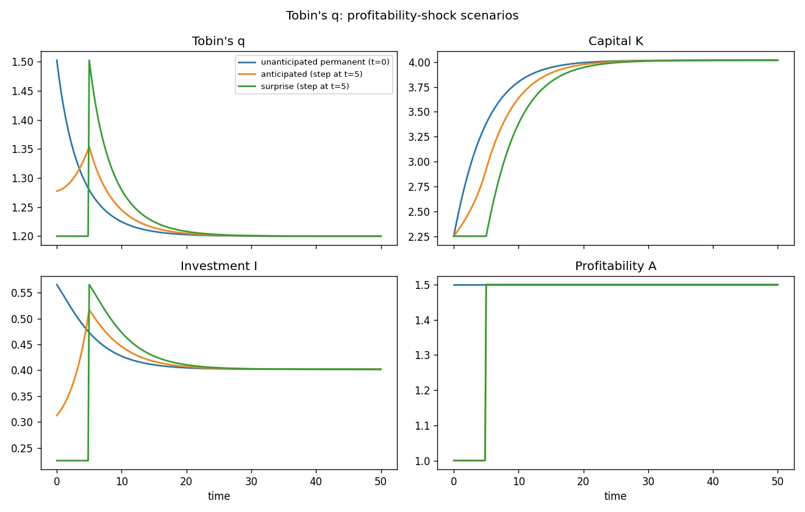

# Continuous-time Tobin's q investment

A textbook **q theory of investment** with convex (quadratic) capital
adjustment costs. A firm holds one state variable — the installed capital stock
`K` — and one jump variable, **Tobin's q**, the shadow value of an extra unit of
installed capital. Investment `I` is a static function of the state and the
jump, driven by exogenous profitability `A`. The shared model lives in
[`common.mod`](common.mod); each scenario file `@#include`s it and adds only an
`initval`, a `shocks`, and a `simulate` block.

## The model

| | equation | meaning |
|---|---|---|
| state | `diff(K) = K*(q - 1)/phi - delta*K` | capital accumulation (net of depreciation) |
| jump  | `diff(q) = (r + delta)*q - alpha*A*K^(alpha-1) - (q - 1)^2/(2*phi)` | the costate (arbitrage) equation for `q` |
| algebraic | `I = K*(q - 1)/phi` | optimal investment rule |

The firm chooses investment to maximise the present value of profits
$A\,K^{\alpha}$ net of a convex adjustment cost $\tfrac{\phi}{2}(I/K)^2 K$. The
first-order conditions deliver an **investment rule linear in q**,

$$I = K\,\frac{q - 1}{\phi},$$

so the firm invests exactly when an installed unit of capital is worth more than
its replacement cost ($q > 1$), and the higher the adjustment-cost parameter
`phi` the more sluggish the response. The capital stock accumulates net of
depreciation,

$$\dot K = K\,\frac{q - 1}{\phi} - \delta K,$$

and Tobin's q evolves along the no-arbitrage (costate) path

$$\dot q = (r + \delta)\,q - \alpha A K^{\alpha - 1} - \frac{(q - 1)^2}{2\phi},$$

which requires that the return $r + \delta$ on holding the installed unit be met
by its marginal profit $\alpha A K^{\alpha-1}$ plus the adjustment cost it
saves. Decreasing returns to capital ($\alpha < 1$) pin down a finite steady
state: with baseline `A = 1` it is `q* = 1.2`, `K* ≈ 2.251`, `I* = delta·K* ≈
0.225`. A permanent rise to `A = 1.5` lifts the capital steady state to
`K* ≈ 4.017` (q returns to `1.2` once the stock has adjusted).

## Factoring with the macroprocessor

`common.mod` holds the declarations, the `model` block, and the analytical
`steady_state_model`. The scenarios pull it in with one directive:

```
@#include "common.mod"
```

Includes are resolved relative to the including file, so the scenarios run from
any working directory. Block ordering is preserved: the include supplies the
declarations and model up front, and each scenario then appends its `initval`,
`shocks`, and `simulate` blocks.

## The scenarios

All three share the same model and the same `simulate(T=50, N=300)`; they differ
only in how profitability is disturbed and in what the firm knows when.

| file | disturbance | information | initial state |
|---|---|---|---|
| [`tobinq.mod`](tobinq.mod) | **permanent** rise `A: 1→1.5` from `t=0` | known at `t=0` | anchored at the pre-shock (`A=1`) SS |
| [`tobinq_anticipated.mod`](tobinq_anticipated.mod) | permanent rise to `1.5` **at `t=5`**, via `step` | **anticipated** at `t=0` (one segment) | `A=1` SS |
| [`tobinq_surprise.mod`](tobinq_surprise.mod) | permanent rise to `1.5` **at `t=5`** | **unanticipated** until `t=5` (two segments) | `A=1` SS |

The instructive pair is `tobinq_anticipated` vs `tobinq_surprise`: the eventual
profitability path is *identical*, but the information differs. Under
anticipation q jumps at `t=0` (the firm brings the news forward and invests
ahead of the change); under the surprise q stays on the old steady state until
the reveal at `t=5`, when the horizon is split into two solved segments.

Shock paths are symbolic functions of the reserved time `t`. Besides the
`if(condition, then, else)` helper and the comparison/logical operators, a small
library of **shape helpers** is available in shocks blocks (only there):
`step(t, t0)` is `0` before `t0` and `1` from `t0` on, used here as
`1 + 0.5 * step(t, 5)`. The `path at t=... = ...` form declares the reveal times
that create segments.

The three scenarios overlaid (generated by `run_tobinq.py`):



Capital `K` is a predetermined state, so it cannot jump; the information
difference shows up in q and investment — both jump at `t=0` under anticipation
but stay flat until the `t=5` reveal under the surprise.

## Simulation results

A **permanent profitability rise** makes the marginal product of capital exceed
the cost of holding it, so Tobin's q jumps above 1 and triggers an investment
boom that builds the capital stock toward a higher steady state. As capital
accumulates its marginal product falls (decreasing returns), q drifts back down
to `1.2`, and investment settles at the new, higher replacement level
`delta·K*`.

- **Unanticipated permanent (`tobinq.mod`).** With `A = 1.5` live from the
  outset, q jumps on impact to about `1.50` and investment to `0.566`. The
  capital stock climbs from `2.251` to `4.017` — exactly the `A = 1.5` steady
  state — while q glides back to `1.2`.
- **Anticipated (`tobinq_anticipated.mod`).** The firm learns at `t=0` that
  profitability will rise at `t=5`, so q jumps **immediately** at `t=0` (to about
  `1.28`) and investment rises **before** A changes — the firm builds capital
  ahead of the more profitable era. q peaks around `t=5` as the change lands,
  then reverts; K and I converge to the same new steady state.
- **Surprise (`tobinq_surprise.mod`).** The same eventual path, but the firm does
  not see it coming: q sits flat at the old steady-state value `1.2` and
  investment at `0.225` until the reveal at `t=5`, when q jumps and the
  investment boom begins. The horizon is split into two perfect-foresight
  segments at the reveal.

All three converge to the same `A = 1.5` steady state (`q* = 1.2`,
`K* ≈ 4.017`, `I* ≈ 0.402`); they differ only in the timing of the q jump and
the head start the capital stock gets.

## Running

With continuo installed (`pip install -e .` from the repository root):

```console
$ continuo examples/tobinq/tobinq_surprise.mod        # writes tobinq_surprise.csv next to it
continuo: wrote 301 rows to examples/tobinq/tobinq_surprise.csv
```

Override the horizon `T`, grid resolution `N`, or output path on the command
line:

```console
$ continuo examples/tobinq/tobinq.mod -T 80 -N 400 -o /tmp/tobinq.csv
```

Or run every scenario and overlay them (writes `tobinq.png`):

```console
$ python examples/tobinq/run_tobinq.py
```

```python
import continuo

model = continuo.parse("examples/tobinq/tobinq_anticipated.mod")
sol = model.simul()                 # or model.simul(horizon=80, intervals=400)
print(sol["q"][0])                  # Tobin's q on impact
ss = model.steady_state(exogenous={"A": 1.5})
```

## A note on anchoring `tobinq`

When a permanent change is already live at `t=0`, the predetermined capital
stock must be anchored at the *pre-shock* steady state rather than the active
one. `tobinq.mod` does this with the `initval(steady, e={…})` override:

```
initval(steady, e={A: 1});   // fill states from the steady state at A = 1
end;
```

`initval(steady)` fills every state from the initial steady state; the `e={…}`
argument evaluates that steady state at the given exogenous values (here `A=1`)
instead of the active ones (`A=1.5`). The same override is available on the
per-variable callable, `steady_state(K, e={A: 1})`, for use inside a plain
`initval` block.

## References

- Tobin, J. (1969), "A General Equilibrium Approach to Monetary Theory,"
  *Journal of Money, Credit and Banking* 1(1):15–29.
- Hayashi, F. (1982), "Tobin's Marginal q and Average q: A Neoclassical
  Interpretation," *Econometrica* 50(1):213–224.
- Abel, A.B. (1982), "Dynamic Effects of Permanent and Temporary Tax Policies on
  the q of Investment," *Journal of Monetary Economics* 9(3):353–373.
- Blanchard, O. & Fischer, S. (1989), *Lectures on Macroeconomics*, Ch. 2.
- Romer, D., *Advanced Macroeconomics*, Ch. 9.
